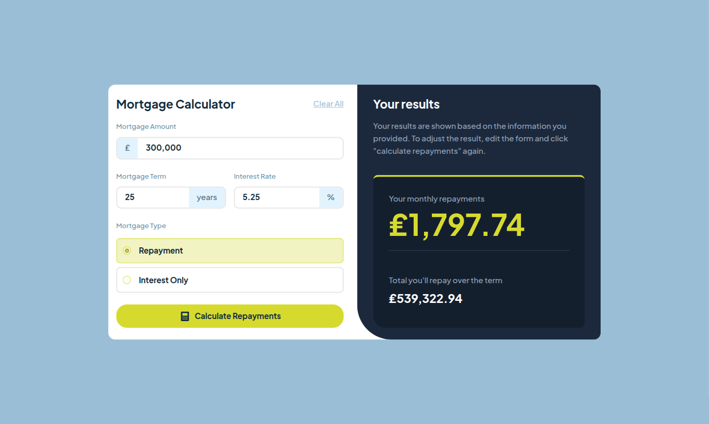

# Frontend Mentor - Mortgage repayment calculator solution

This is a solution to the [Mortgage repayment calculator challenge on Frontend Mentor](https://www.frontendmentor.io/challenges/mortgage-repayment-calculator-Galx1LXK73). Frontend Mentor challenges help you improve your coding skills by building realistic projects.

## Table of contents

- [Overview](#overview)
    - [The challenge](#the-challenge)
    - [Screenshot](#screenshot)
    - [Links](#links)
- [My process](#my-process)
    - [Built with](#built-with)
    - [Useful resources](#useful-resources)
- [Author](#author)

## Overview

### The challenge

Users should be able to:

- Input mortgage information and see monthly repayment and total repayment amounts after submitting the form
- See form validation messages if any field is incomplete
- Complete the form only using their keyboard
- View the optimal layout for the interface depending on their device's screen size
- See hover and focus states for all interactive elements on the page

### Screenshots

| Desktop View                                     | Mobile View                                    |
|--------------------------------------------------|------------------------------------------------|
|  |  |

### Links

- Solution URL: [GitHub](https://github.com/thyuhtooaung-dev/Repayment-Calculator)
- Live Site URL: [Vercel](https://repayment-calculator-eta.vercel.app/)

## My process

### Built with

- [React](https://reactjs.org/)
- [Tailwindcss](https://tailwindcss.com/)
- [Motion](https://motion.dev/)
- [ShadCN](https://ui.shadcn.com/)

### Useful resources

- [Framer Motion Documentation](https://www.framer.com/motion/) – This documentation helped me understand how to use Motion for animations in React. The examples are clear and show common animation patterns that are easy to reuse.
- [shadcn/ui Documentation](https://ui.shadcn.com/docs) – This resource explains how shadcn components are structured and composed. It helped me understand how to customize and extend components instead of treating them as a fixed library.

## Author

- Github - [Thyu Htoo Aung](https://github.com/thyuhtooaung-dev)
- Frontend Mentor - [@PoungMont](https://www.frontendmentor.io/profile/thyuhtooaung-dev)
- X - [@PoungMont](https://x.com/Poung_Mont)